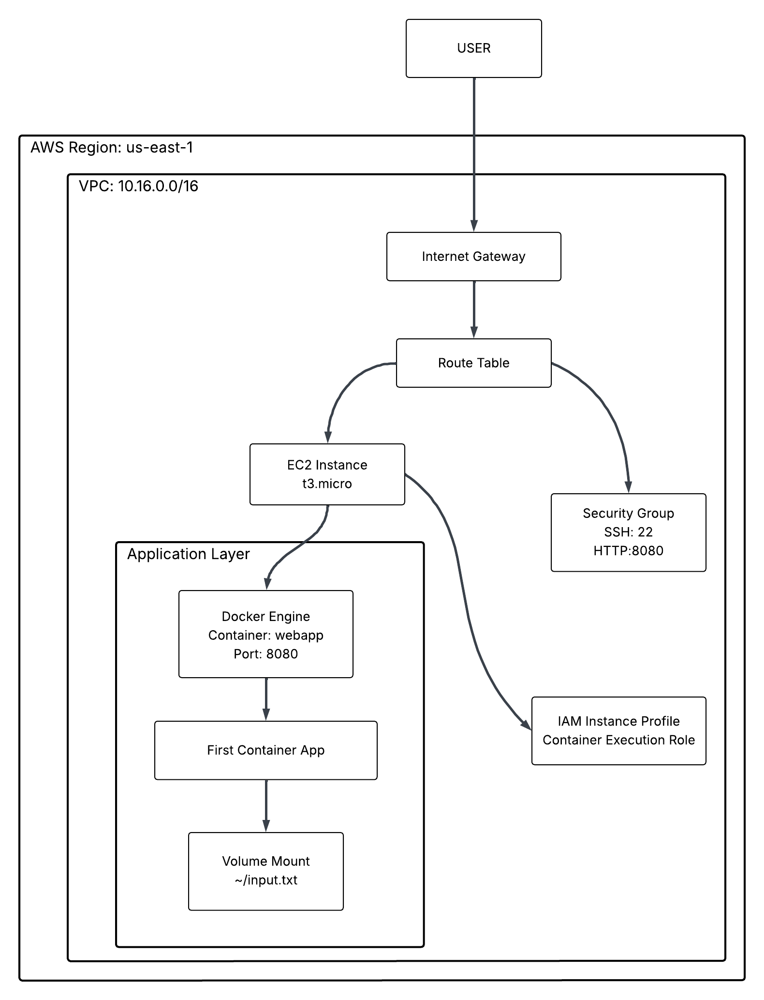

# Deploying and APP on AWS Container

This markdown demonstrates container deployment on AWS using Docker, CloudFormation, EC2.

## Prerequisites

- AWS CLI configured with appropriate permissions
- Basic familiarity with Docker and AWS services

## Architecture Overview
The CloudFormation template provisions:
- **VPC** with public subnet and internet gateway
- **IAM roles** with necessary permissions for container execution
- **Security group** with configurable access rules

## Reources

- [Quick Start](1.DEPLOY.md)
- [Store Container](2.PUSH_TO_ECR.md)